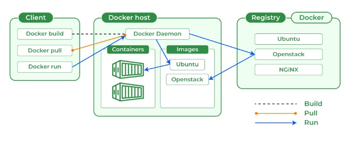
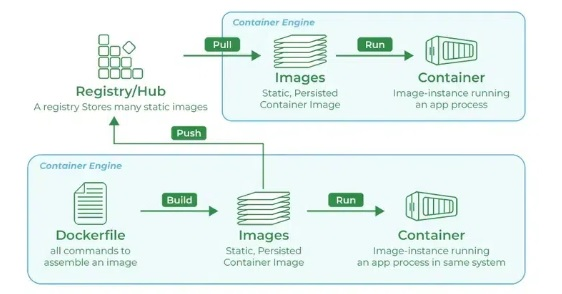

# Containerizing With Docker Engine

Docker containers are `self-contained` units that include everything an application needs to run, from its code to its `libraries` and dependencies.

Simply put, it solves the *"It worked on my machine"* problem.


# Docker Concepts



| Name          | Description                           |
|---------------|---------------------------------------|
| Container     | A box filled with dependencies        |
| Client        | Where we run docker commands          |
| Host          | Where containers live                 |
| Daemon        | Who manages docker operations         |
| Registry      | Where images live                     |
| Images        | A container blueprint                 |
| Dockerfile    | Who creates images                    |
| Objects       | Instances of things like images       |
| Storage       | A place to keep files                 |



# Docker Engine vs Docker Desktop

Docker Engine is a lower-level tool, geared towards system administrators. On the other hand, Docker Desktop provides developers with a user-friendly interface and additional tools.

# Installing Docker Engine

The easiest way to install Docker is with a convenience script they provide.

```ruby
curl -fsSL https://get.docker.com -o get-docker.sh
sudo sh get-docker. sh
```

# Pulling a Docker Image

By pulling an image from a public repository like Docker Hub, you can quickly deploy a pre-built application without manually installing all the dependencies. Let's pull the `hello-world` image.

```ruby
sudo docker pull hello-world
```

# Checking the images

```ruby
sudo docker images

```


# Running the image

```ruby
sudo docker run hello-world
```


# Running an Interactive Image in the Background

In most cases, you'll likely use the `-d` or `-its flags along with the `run` command.

1. Use `-d` for background processes or services.
2. Use `-it` to start a container in the foreground and interact with it like a regular terminal session.

# Docker --Help
Use `sudo docker --help` to see all commands and `sudo docker <command> --help` to see all available flags(options) for the command. 


# Usefull Docker Commands

| Name                                                 | Description                              |
|------------------------------------------------------|------------------------------------------|
| docker rm `id`                                       | Removes containers                       |
| docker rmi `name`                                    | Removes images                           |
| docker ps                                            | List containers                          |
| docker stop `id`                                     | Stop a running container                 |
| docker run `-dti --name container image`             | Name a container                         |
| docker exec `-ti Ubuntu /bin/bash`                   | Executes bash inside Ubuntu              |
| docker exec `Ubuntu mkdir /destiny`                  | Creates a `destiny` inside the container |
| docker `cp file container:/destiny`                  | Copy to container from local machine     | 
| docker `cp container:/originfolder/file new-filename` | Copy to local machine from container     | 
| docker pull debian:9                                 | Pulls specific Debian container version  | 

# Installing a MYSQL container

Running a MYSQL database in a container prevents conflicts with other software or system-wide configurations.

```ruby
docker pull MySQL
```

# Running a MySQL container

```ruby
docker run -e MYSQL_ROOT_PASWORD=password --container name -d -p 3306:3306 image-name
```
1. `-e` Sets environmental variables.
2. `-d` Executes the database in the background.
3. `-p` Opens a port to communicate with the database. 


# Accesing MYSQL to create a Database

Executing bash inside the MySQL container to manage the database.

```ruby
docker exec -it container-name bash 
```

# MYSQL client

Another way to interact with the database is through the Mysql client.

```ruby
apt -y install mysql-client
```

# Login to MYSQL to create a new database

After accessing bash we must login into MySQL to be able to manage our databases via SQL. After inserting the command below we will be prompted to insert the `root` user password. 

```ruby
MySQL -u root -p --protocol=tcp
```

# Troubleshooting connection issues

Docker assigns an IP to every container to be able to connect with other distributed systems independently. To troubleshoot any connection issues we must use the `inspect` command.

```ruby
docker inspect container-name
```

# Data storage in containers

Containers are ephemeral, meaning their data is lost when the container stops. Mounts allow you to persist data beyond the container's lifecycle. A mount is a way to share data or files between the host system and the container. It essentially creates a link between a directory or file on the host machine and a directory within the container.

```ruby
docker run -e MYSQL_PASSWORD=your-password --name container-name -d -p 3306:3306 --volume=/host-path -A:/container-path image-name
```
# Mount Types

1. Bind: Binds a directory from the container to a directory in the host (example above)

```ruby
docker run -v /hostdir:/containerdir image-name
``` 
2. Named: Manually created volumes inside a standard directory.

```ruby
docker volume create volume-name # Creates volumes
docker run -v volume-name:/container-directory image name # Refeerences the created volume
```

# Install Docker Compose

Before executing the yaml file it's important to install docker compose. This task is achieved by coding the following command into the terminal.

```ruby
apt install docker-compose
```

# Create the YML file

After docker-compose is installed we must create the yaml file that will contain the infrastructure we desire to create. The script below shows an example of an Apache web server container deployment.

```ruby
version: '3.9'
services:
  apache:
    image: httpd:latest
    container_name: my-apache-app
    ports:
    - '8081:80'
    volumes:
    - ./website:/usr/local/apache2/htdocs
```

# Executing the script

Finally, we must execute the script so our infrastructure( in this case our Apache web server) will be created. We can do that by typing the following command into the console.

```ruby
docker-compose up -d
```

# Conclusion

Docker Compose manages adding or removing service instances with ease. Finally, version control of the YAML configuration file simplified version management for all their services.
In short, Docker Compose helped Acme Corp. achieve faster development cycles, smoother deployments, and better scalability for their application.
