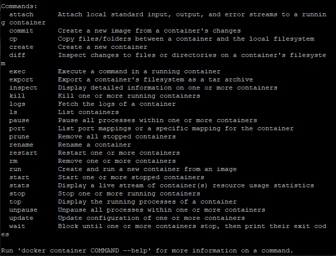

# Containerizing With Docker Engine

Docker containers are `self-contained` units that include everything an application needs to run, from its code to its `libraries` and dependencies. This makes them highly portable and allows them to run consistently on any system with Docker installed, regardless of the underlying operating system. Simply put, it solves the *"It worked on my machine"* problem.


Here's an example of a simple Dockerfile that runs a Nginx web server

```yaml
# Use the official nginx image as the base
FROM nginx:latest

# Copy the contents of the current directory to /usr/share/nginx/html in the container
COPY . /usr/share/nginx/html

# Expose port 80 (the default web server port)
EXPOSE 80

# Run the nginx command
CMD ["nginx", "-g", "daemon off;"]

```
# Docker Concepts


| Name          | Description                           |
|---------------|---------------------------------------|
| Container     | A box filled with dependencies        |
| Client        | Where we run docker commands          |
| Host          | Where containers live                 |
| Daemon        | Who manages docker operations         |
| Registry      | Where images live                     |
| Images        | A container blueprint                 |
| Dockerfile    | Who creates images                    |
| Objects       | Instances of things like images       |
| Storage       | A place to keep files                 |


# Docker Engine vs Docker Desktop

Docker Engine is a lower-level tool, geared towards system administrators. On the other hand, Docker Desktop provides a user-friendly interface and additional tools for developers.

# Installing Docker Engine

The easiest way to install Docker is with a convenience script they provide.

```ruby
curl -fsSL https://get.docker.com -o get-docker.sh
sudo sh get-docker.sh
```

# Pulling a Docker Image

By pulling an image from a public repository like Docker Hub, you can quickly deploy a pre-built application without having to manually install all the dependencies yourself. Let's pull the `hello-world` image.

```ruby
sudo docker pull hello-world
```

# Checking the images

```ruby
sudo docker images

```


# Running the image

```ruby
sudo docker run hello-world
```


# Running an Interactive Image in the Background

In most cases, you'll likely use the `-d` or `-it` flags along with the `run` command.

1. Use `-d` for background processes or services.
2. Use `-it` to start a container in the foreground and interact with it like a regular terminal session.

# Docker --Help
Use `sudo docker --help` to see all commands and `sudo docker <command> --help` to see all available flags(options) for the command. 



# Usefull Docker Commands

| Name                                       | Description                           |
|--------------------------------------------|---------------------------------------|
| docker rm `id`                             | Removes containers                    |
| docker rmi `name`                          | Removes images                        |
| docker ps                                  | List containers                       |
| docker stop `id`                           | Stop a running container              |
| docker run `-dti --name container image`   | Name a container                      |
| docker exec `-ti Ubuntu /bin/bash`         | Executes bash with Ubuntu             |
| docker                                     | Who creates images                    |
| docker Objects                             | Instances of things like images       |
| docker Storage                             | A place to keep files                 |


# Install Docker Compose

Before executing the yaml file it's important to install docker compose. This task is simply achieved by coding the following command into the terminal.

```ruby
apt install docker-compose
```

# Create the YML file

After docker-compose is installed we must create the yaml file that will contain the infrastructure we desire to create. The script below shows an example of an Apache web server container deployment.

```ruby
version: '3.9'
services:
  apache:
    image: httpd:latest
    container_name: my-apache-app
    ports:
    - '8081:80'
    volumes:
    - ./website:/usr/local/apache2/htdocs
```

# Executing the script

Finally, we must execute the script so our infrastructure( in this case our Apache web server) will be created. We can do that by typing the following command into the console.

```ruby
docker-compose up -d
```

# Conclusion

Docker Compose manages adding or removing service instances with ease. Finally, version control of the YAML configuration file simplified version management for all their services.
In short, Docker Compose helped Acme Corp. achieve faster development cycles, smoother deployments, and better scalability for their application.
