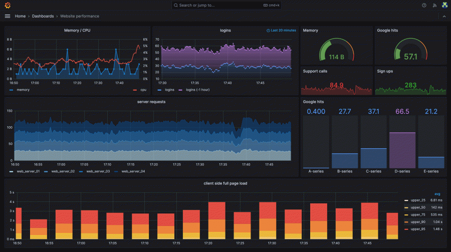

# Performance & Optimization

By monitoring container performance metrics like CPU, memory, and network usage, you can identify and troubleshoot issues before they impact users. This proactive approach helps prevent outages and ensures high application service quality.

# Requirements

1. Docker: Container management
2. Prometheus: Scrapes metrics
3. Node Exporter: Export metrics
5. Grafana: Build dashboards for monitoring

# Folder Structure

A well-defined structure promotes modularity.  Each service or component can reside in its directory, encapsulating its configuration files, Dockerfile, and related scripts.  This promotes reusability and independent development of each service.

```bash
#! bin\bash

echo "Creating Folder Structure"

mkdir -p prometheus
mkdir -p grafana
mkdir -p node-exporter
touch /prometheus/prometheus.yml
touch /grafana/docker-compose.yml
touch /prometheus/docker-compose.yml

echo "Folder Structure Created"

```

# Grafana

Grafana empowers you to turn raw data into actionable insights. By providing a centralized platform for visualization, exploration, and alerting, it helps you make data-driven decisions and optimize your systems. 



Here's how to spin up Grafana using docker-compose.

```yml
version: "3.8"
services: 
  grafana:
    image: grafana/grafana
    container_name: grafana
    restart: unless-stopped # Ensure grafana runs even if docker restarts
    ports:
     - '3000:3000'  # Allows to access UI in port 3000.
    volumes:  # Without defined volumes data will be lost when volume restarts.
      - grafana-storage:/var/lib/grafana # Mounts a local directory (grafana-storage) to
a directory(var/lib/grafana) inside the container.
volumes:
  grafana-storage: {}

```

# Prometheus

Prometheus provides a robust and efficient solution for monitoring and alerting, making it a popular choice for organizations of all sizes.
