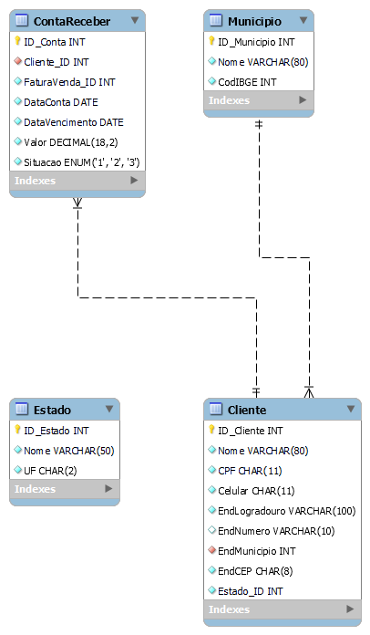
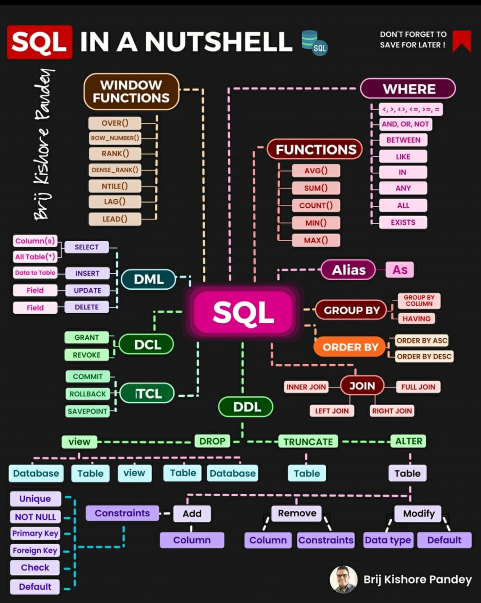

# SGBD

120 minutes

SGBD (Database Management Databases are one of the core pillars of every `system architecture`. They are essential for managing data. 

# Table of Contents

1. Prerequisites
2. Connecting to a MySQL Database Via CLI
3. Modeling And Designing A Database With MySql Workbench
4. Deploying A Database Via Script
5. Inserting Data Via Script
6. Creating A View For Easy Acces.
7. Conclusion

# Prerequisites

1. MySQL Community Server
2. MySQL Workbench

# Connecting Via CLI

The CLI(command line interface) provides a direct way to interact with the `database server`. 

```ruby
mysql -u root -p
```

# Modeling With MySql Workbench

MySQL Workbench offers a set of tools for modeling and `designing databases`. 



# SQL Categories

In SQL, there are five main categories of commands, each serving a specific purpose in managing and interacting with databases. By understanding these different categories of SQL commands, you can effectively manage your database, ensuring proper `data structure`, manipulation, `security`, and retrieval capabilities.



# DML

DML stands for `Data Manipulation Language`. It's a category of languages used in computer programs or by database users to interact with data in a database. Its main commands are `SELECT`; `INSERT`; `UPDATE`; and `DELETE`.

| DML(Data Manipulation)                                         | Data Manipulation                       |                                    |                                      |   
|--------------------------------------------------------------- |-----------------------------------------|------------------------------------|--------------------------------------|
| `SELECT` column1 `FROM` table;                                 | `SELECT` column1 `FROM` table           |                                                     |                      
| `INSERT INTO` table_name `VALUES` value1;                      | 
| `UPDATE` table_name `SET` column1 = value1, `WHERE` condition; |              
| `DELETE FROM` table_name `WHERE` condition;                    |                    


# Conclusion

This repository has equipped you with a comprehensive understanding of MySQL, from its core concepts to `advanced functionalities`. You've explored data manipulation, querying, security, administration, and even how to leverage views for optimized data access. 

# Next

We will explore the SQL language in detail.

