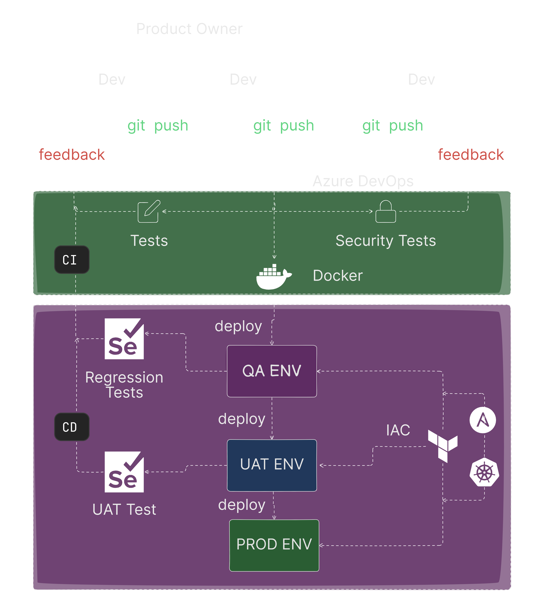

# 1. Automating the creation of users, directories, permissions, and groups with Bash

This script will automate the creation of new developer accounts on the system, assign them directories and permissions based on their role, and add them to relevant development groups. This eliminates manual setup and ensures consistency.
`BEGINNER` `BASH` `LINUX`

```ruby
# Creating directories
sudo mkdir /public  # sudo execute the command with superuser privileges
sudo mkdir /frontend     # mkdir is the command for creating a directory
sudo mkdir /backend
sudo mkdir /ops

# Creating groups
sudo groupadd GRP_FRONTEND  # groupadd creates a new group
sudo groupadd GRP_BACKEND
sudo groupadd GRP_OPS
```

2.`Implementing a version control system with Git/Github:`
We will use Git for version control and Github for a central repository. Developers will have access to the latest codebase and can track changes efficiently.
`BEGINNER` `GIT` `GITHUB`
```ruby
git clone <URL>
git add <filename> # to stage specific files for commit.
git commit -m "Meaningful commit message" # to create a snapshot of their changes with a descriptive message
git branch -M main
git remote add origin <repo URL> # This command configures a remote repository.
git push origin <branch_name>
```


3.`Deploying infrastructure with Terraform:`
Terraform will automate the provisioning of infrastructure like servers, databases, and storage on a chosen cloud platform. This ensures consistent and repeatable infrastructure deployment.
`INTERMEDIATE` `TERRAFORM` `CLOUD COMPUTING`

4.`Creation of CI/CD pipeline with Azure DevOps:`
Azure DevOps will be used to create a continuous integration and continuous delivery (CI/CD) pipeline. Upon code commit, the pipeline will automatically build, test, and deploy the application to a staging environment.
`INTERMEDIATE` `AZURE DEVOPS` `DEVOPS`

5.`Containerizing an application with Docker:`
The application will be containerized using Docker, creating a self-contained package with all dependencies. This promotes portability and simplifies deployments.
`INTERMEDIATE` `DOCKER` `LINUX`

6.`Deploying a web application with Kubernetes:`
Kubernetes will be used to orchestrate the deployment of Docker containers across multiple servers for scalability and high availability.
`ADVANCED` `KUBERNETES` `DOCKER`

7.`Automating Web App deployment with Bash`
A Bash script will trigger the Azure DevOps pipeline upon code commit, automating the entire deployment process.
`ADVANCED` `BASH` `LINUX` `AZURE DEVOPS`

8.`Setting developing environment with Vagrant:`
To provide developers with a consistent development environment locally, Vagrant will be used to create virtual machines pre-configured with all the necessary tools and dependencies.
`ADVANCED` `VAGRANT` `IAC`

## Final Infrastructure

Our end goal with this business case project is to be able to replicate a Software Engineering pipeline like the one in the image below.



## Benefits

1. `Faster Onboarding:` Developers are up and running quickly with a pre-configured environment.
2. `Reduced Errors:` Automated provisioning and deployment minimize human error.
3. `Improved Version Control:` Git ensures proper code tracking and collaboration.
4. `Scalable Infrastructure:` Terraform and Kubernetes handle scaling needs.
5. `Efficient Delivery:` CI/CD pipeline automates builds, tests, and deployments.
6. `Consistent Development Environments:` Vagrant provides a uniform development experience for everyone.

## Conclussion

This combination of scripts automates the entire development and deployment process, saving time, increasing efficiency, and reducing errors. This allows your team to focus on developing innovative features for your e-commerce platform.
