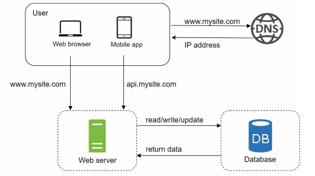

# System Design

2 hours

System design is the blueprint for a software system. It's about `defining the architecture`, components, modules, interfaces, and data flow to achieve specific goals.

# Single Server Set Up

A single server setup is a `configuration` where all system components, such as the web server, database, application server, and file storage, reside on a single physical or virtual machine.

1. The user accesses the website through a domain name.
2. The `IP address` is returned to the browser
3. Hypertext transfer protocol requests are sent to the web server.
4. The web server returns the HTML to the browser for rendering.


The script below illustrates an Apache web server deployment.

```ruby

#!/bin/bash
----------------------------------------------------------------------------------
echo "Updating and installing apache2 and unzip..."
apt-get update
apt-get upgrade -y
apt-get install apache2 -y
apt-get install unzip -y
----------------------------------------------------------------------------------
echo "Getting the website from a remote repo..."
cd /tmp
wget https://github.com/denilsonbonatti/linux-site-dio/archive/refs/heads/main.zip
----------------------------------------------------------------------------------
echo "Unziping the file and pasting into the Apache directory..."
unzip main.zip
cd linux-site-dio-main
cp -R * /var/www/html/
----------------------------------------------------------------------------------

```

# Database

With the growth of the user base, one server is not enough, and we need multiple servers: one for web/mobile traffic, and the other for the `database`. Separating web/mobile traffic (web tier) and database (data tier) servers allows them to be scaled independently.



Here's a MySQL database containerized deployment using Kubernetes. 

```ruby
# Mysql deployment
apiVersion: apps/v1
kind: Deployment
metadata:
  name: mysql
spec:
  selector:   # Select pods with the label "mysql"
    matchLabels:
      app: mysql
  template: # a blueprint for creating pods
    metadata: # Data about the data
      labels:  # Identify pods 
        app: mysql
    spec:
      containers:
      - image: alemorales9011935/projeto-database:1.0 # Docker image used for the deployment
        args:
        - "--ignore-db-dir=lost+found"  # Ignores previous deployments
        imagePullPolicy: Always # Ensure the image is pulled even if exists locally
        name: mysql
        ports:
        - containerPort: 3306
          name: mysql
          
        volumeMounts:
        - name: mysql-dados
          mountPath: /var/lib/mysql/ # where the containers will be storaged
      volumes:
      - name: mysql-dados
        persistentVolumeClaim:
          claimName: mysql-dados
```

# Load Balancer

A `load balancer` evenly distributes incoming traffic among web servers that are defined in a load-balanced set. Users connect directly to the load balancer's public IP. 

With this setup, web servers are no longer directly unreachable by clients. 


For better security, `private IPs` are used for communication between servers. A private IP is an IP address reachable only between servers in the same network; however, it is unreachable over the Internet.

The configuration below defines a `LoadBalancer` service for a PHP application using Kubernetes. 

```ruby
apiVersion: v1 
kind: Service # Defines the type of Kubernetes object
metadata:
  name: php
spec:
  selector: # This service will find and route traffic to pods that have the label app: php. 
    app: php  # Select pods with the label "app: php"
  ports:
  - port: 80 # The port users will access from outside the cluster
    targetPort: 80 # The port php application listens 
  type: LoadBalancer # Type of Service
```

# Database Replication

Database replication can be used in many database management systems, usually with a master/slave relationship between the original (master) and the copies
(slaves). This architecture allows for failover and redundancy.


Here's a Data replication Deployment with docker-compose. 

```ruby
version: '3.7'

services:
  mysql-master:
    image: mysql:latest
    container_name: mysql-master
    environment:
      MYSQL_ROOT_PASSWORD: your_root_password
      MYSQL_DATABASE: your_database
      MYSQL_USER: your_user
      MYSQL_PASSWORD: your_password
      MYSQL_REPLICATION_MODE: master
      MYSQL_REPLICATION_USER: repl_user
      MYSQL_REPLICATION_PASSWORD: repl_password
    ports:
      - "3306:3306"
    volumes:
      - mysql-data:/var/lib/mysql

  mysql-slave:
    image: mysql:latest
    container_name: mysql-slave
    environment:
      MYSQL_ROOT_PASSWORD: your_root_password
      MYSQL_DATABASE: your_database
      MYSQL_USER: your_user
      MYSQL_PASSWORD: your_password
      MYSQL_REPLICATION_MODE: slave
      MYSQL_REPLICATION_USER: repl_user
      MYSQL_REPLICATION_PASSWORD: repl_password
      MYSQL_MASTER_HOST: mysql-master
      MYSQL_MASTER_PORT: 3306
    ports:
      - "3307:3306"
    depends_on:
      - mysql-master
    volumes:
      - mysql-data:/var/lib/mysql

volumes:
  mysql-data:

```
# Cache

A cache is a temporary storage area that stores the result of expensive responses or frequently accessed data in memory so that subsequent requests are served more quickly. 

Common Use Cases

1. Caching: Improve application performance by storing frequently accessed data in memory.
2. Session management: Store user session data for faster access.
3. Messaging: Real-time communication between applications.


Caching with Redis: Redis stands for Remote DIctionary Server. It's an open-source, in-memory data structure store that's primarily used as a cache or quick-response database. Here's a simple Redis deployment using docker-compose.

```ruby
version: '3.7'

services:
  redis:
    image: redis:latest
    container_name: redis
    ports:
      - "6379:6379"
```

